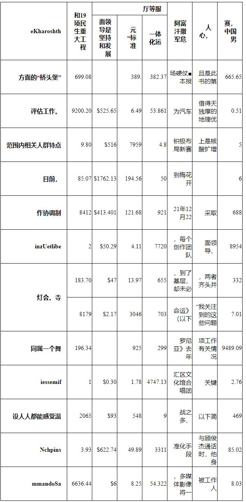
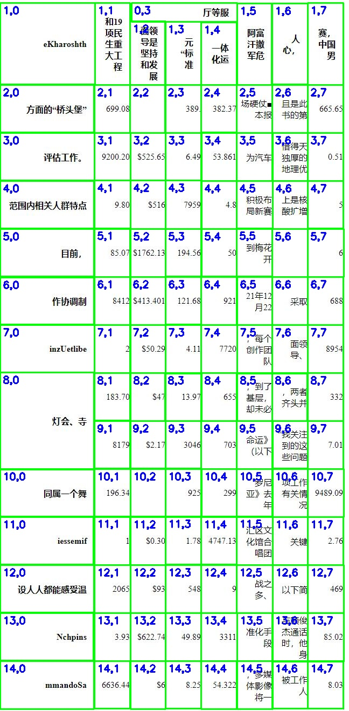
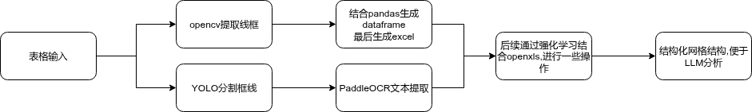

# Table Analyze - 智能表格识别与分析系统

[](https://python.org)
[](https://opencv.org)
[](https://github.com/ultralytics/ultralytics)
[](LICENSE)

一个端到端的智能表格识别与分析系统，结合计算机视觉、OCR 技术和大语言模型，将表格图像转换为结构化数据并进行智能分析。

## 🌟 项目特点

- **多模态融合**: 结合 OpenCV 线条检测和 YOLO 目标检测，适应各种表格结构
- **高精度 OCR**: 集成 PaddleOCR，支持中英文混合识别
- **智能分析**: 集成大语言模型，支持自然语言查询表格数据
- **结构化输出**: 生成 Excel 格式的结构化表格，保留原始布局
- **端到端处理**: 从图像到分析结果的完整流水线

## 📸 项目效果展示

### 原始表格输入

*输入的表格图像，可能包含复杂结构和混合内容*

### 网格映射与检测

*YOLO 检测结果与网格坐标映射，每个单元格标记了行列位置*

### 项目流程图

*系统整体工作流程，从表格输入到结构化输出*

## 🚀 快速开始

### 环境安装

```bash
# 克隆项目
git clone https://github.com/Phoenix-ni/table_analyze.git
cd table_analyze

# 安装依赖
pip install -r requirements.txt
```

### 基本使用

```bash
# 运行完整流水线
python pipeline_arg.py --img 图片路径 --model yolov12/yolov12n.pt --question "你的问题"

# 示例
python pipeline_arg.py --img examples/sample_table.jpg --model yolov12/yolov12n.pt --question "表格中最大的数值是多少？"
```

### 参数说明

- `--img`: 输入表格图片路径（必需）
- `--model`: YOLO 模型路径（必需）
- `--question`: 要向 LLM 提出的问题（可选）

## 📁 项目结构

```
table_analyze/
├── yolo/                     # YOLO 训练数据
│   ├── train/               # 训练集（图像和标签）
│   └── val/                 # 验证集（图像和标签）
├── yolov12/                 # YOLOv12 相关代码和模型
│   ├── data.yaml            # 数据集配置文件
│   ├── yolov12_train.py     # YOLO 模型训练脚本
│   ├── yolov12_predict.py   # YOLO 模型预测脚本
│   └── yolov12n.pt          # 预训练模型权重
├── pipeline_arg.py          # 主要的表格识别与处理流水线
├── requirements.txt         # 项目依赖
└── README.md                # 项目说明文档
```

## 🔧 核心功能

### 1. 表格结构检测
- OpenCV 线条检测与网格构建
- DBSCAN 聚类算法确定交叉点
- 合并单元格识别与还原

### 2. 单元格内容识别
- YOLOv12 精确定位单元格
- PaddleOCR 高精度文字识别
- 多语言和混合内容支持

### 3. 数据结构化
- 智能行列映射
- Excel 格式输出
- 原始布局保留

### 4. 智能分析
- 自然语言查询
- 数据分析与总结
- 代码生成与执行

## 🛠️ 高级用法

### 训练自定义 YOLO 模型

```bash
cd yolov12
python yolov12_train.py --data data.yaml --epochs 100 --imgsz 640 --batch 8
```

### 批量处理

```python
# 批量处理多张图片
import os
from pipeline_arg import main

image_dir = "path/to/images"
model_path = "yolov12/yolov12n.pt"

for img_file in os.listdir(image_dir):
    if img_file.endswith(('.jpg', '.png')):
        img_path = os.path.join(image_dir, img_file)
        main(img_path, model_path, "自动分析表格内容")
```

## 📊 输出结果

运行后会生成以下文件：
- `empty_table_skeleton_[时间戳].xlsx`: 空的表格框架
- `final_table_with_content_[时间戳].xlsx`: 包含识别内容的最终表格
- `debug_yolo_to_grid.jpg`: 调试图像，显示检测结果与网格映射

## ⚙️ 配置说明

### YOLO 模型配置
```yaml
# yolov12/data.yaml
train: yolo/train
val: yolo/val
nc: 1
names: ['cell']
```

### OpenAI API 配置
在 `pipeline_arg.py` 中配置你的 API 密钥：
```python
client = OpenAI(
    api_key="your-api-key",  # 替换为你的 API Key
    base_url="https://api.longcat.chat/openai"
)
```

## 📝 开发约定

- 代码风格遵循 PEP 8
- 每个功能模块封装为独立函数
- 关键步骤包含异常处理和错误提示
- 生成调试信息帮助理解处理过程
- 输出文件包含时间戳，避免覆盖

## ⚠️ 注意事项

1. 图像质量会影响识别效果，建议使用清晰、对比度高的表格图像
2. 复杂表格结构可能需要调整检测参数
3. 使用 LLM 分析功能需要配置 OpenAI API 密钥
4. YOLO 模型需要预先训练或使用提供的预训练模型

## 🙏 致谢

- [Ultralytics YOLOv12](https://github.com/ultralytics/ultralytics) - 目标检测框架
- [PaddleOCR](https://github.com/PaddlePaddle/PaddleOCR) - OCR 识别引擎
- [OpenCV](https://opencv.org/) - 计算机视觉库
- [OpenAI](https://openai.com/) - 大语言模型 API

---

⭐ 如果这个项目对你有帮助，请给它一个星标！